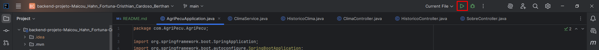

# Consulta de Clima e Tempo para Agropecuária - Serviço de Meteorologia - API REST

## Descrição

Esta API REST fornece dados meteorológicos para cidades cadastradas, incluindo informações do clima atual e previsões futuras. Ideal para aplicativos que desejam consultar o tempo de forma simples e eficiente.

## Estrutura do Projeto

A estrutura do projeto segue a arquitetura em camadas, com separação conforme abaixo:

* **`controller`**: Responsável por lidar com as requisições HTTP e rotear para os serviços adequados.
* **`model`**: Contém as classes de DTOs (Data Transfer Objects) para requisição/resposta e as entidades JPA para persistência.
* **`repository`**: Interfaces Spring Data JPA para acesso ao banco de dados.
* **`service`**: Contém a lógica de negócio, processamento dos dados e interação com repositórios e APIs externas.

## Principais Entidades

1.  **`Usuario`**: Representa um usuário do sistema.
    * **Atributos**: `id`, `nome`, `email`.
    * **Relacionamento**: Um `Usuario` pode ter muitas `ConsultaClima` (1:N).
    * **Métodos CRUD**: `getOne`, `getAll`, `create`, `update`, `delete` (via `UsuarioService`).

2.  **`ConsultaClima`**: Registra cada consulta e avaliação de clima realizada pelos usuários.
    * **Atributos**: `id`, `cidade`, `tipo` (agricultura/pecuaria), `atividade`, `recomendacao`, `condicoesAtuais`, `avaliacao`, `dataHoraConsulta`, `usuario_id` (FK).
    * **Relacionamento**: Muitas `ConsultaClima` pertencem a um `Usuario` (N:1).
    * **Métodos CRUD**: `getOne`, `getAll`, `create`, `update`, `delete` (via `ConsultaClimaService`).
    * **Cache**: Esta entidade utiliza cache para otimização das requisições `getAll` e `getOne`, configurado para expirar após 60 segundos.

## Endpoints da API

### Clima e Recomendações
- `POST /clima` - Retorna dados referente ao clima e o tempo.
- `POST /avaliar` - Retorna dados referente ao clima da cidade correspondente e traz sugestões da atividade favorável com base no clima atual.

### Histórico de Consultas
- `GET /sobre` - Informações sobre os autores do projeto.
- `GET /histórico` - Histórico de todas as consultas e requisições realizadas.

### Gerenciamento de Usuários
- `GET /usuarios` - Retorna todos os usuários.
- `GET /usuarios/{id}` - Retorna um usuário específico através do ID.
- `POST /usuarios` - Cria um novo usuário.
- `PUT /usuarios/{id}` - Atualiza um usuário existente através do ID.
- `DELETE /usuarios/{id}` - Remove um usuário através do ID.

### Gerenciamento de Consultas de Clima
- `GET /consultas/` - Retorna todas as consultas de clima salvas (com cache).
- `GET /consultas/{id}` - Retorna uma consulta de clima específica por ID (com cache).
- `POST / consultas` - Cria uma nova entrada de consulta de clima diretamente DB.
- `PUT /consultas/{id}` - Atualiza uma consulta de clima existente por ID.
- `DELETE /consultas/{id}` - Remove uma consulta de clima por ID.
- `GET /consultas/cidade/{cidade}` - Busca consultas de clima filtradas por cidade (com cache).
- `GET /consultas/usuario/{usuarioId}` - Busca consultas de clima filtradas por ID de usuário (com cache).

## Instruções de como executar o projeto

### Pré requisitos:

- IDE que seja compatível com Spring, como por exemplo o InteliJJ IDEA, Spring Tool Suite, Eclipse ou a versão gratuita do IntelliJ Comumunity Edition;
- JDK (Java Development Kit) com versão 8 ou superior instalado;
- Maven versão 3.3.2+ para realizar a gestão das dependências;
- Ferramenta para executar **requisições HTTP** (GET, POST, PUT, DELETE). Recomenda-se o `Postman` ou o `Insomnia`;
- Um servidor PostgreSQL em execução (com um banco de dados `agripecu_db` criado);
- Uma chave da API do OpenWeatherMap (gratuita para uso básico).

### Instruções de uso:
1. Abra a IDEA (neste exemplo, utiliza-se o `InteliJJ Community Edition`)
2. Siga o caminho conforme imagem abaixo:


3. Clonar repositório e preencher a seguinte URL:

`https://github.com/MaicouHahn/backend-projeto-Maicou_Hahn_Fortuna-Cristhian_Cardoso_Berthan.git`


4. Abrir a camada da aplicação chamada `AgriPecuApplica`
5. Inicializar a aplicação através do botão `Run`



6. Aplicação inicializada com sucesso.


7. Abra a ferramenta para executar as requisições HTTP (neste exemplo, utiliza-se o `Postman`)


## 1º Exemplo de uso
- **POST ``/clima``**
```json
{
  "cidade": "Criciúma",
  "tipo": "agricultura",
  "atividade": "colheita"
}
```
- **Retorno**
```json
{
  "cidade": "Criciúma",
  "condicoesAtuais": "nublado, 23.75°C",
  "recomendacao": "Clima ideal para colheita. Aproveite o tempo seco."
}
```

## 2º Exemplo de uso
- **POST ``/avaliar``**
```json
{
  "cidade": "Criciúma"
}
```
- **Retorno**
```json
{
  "cidade": "Criciúma",
  "clima": "nublado, 24.31°C",
  "avaliacao": "Clima favorável para atividades no campo."
}
```

## 3º Exemplo de uso
- **GET ``/sobre``**
```json
{}
```
- **Retorno**
```json
{
  "integrantes": ["Maicou Hahn Fortuna","Cristhian Cardoso Bertan"],
  "nome_projeto": "AgriPecu"
}
```

## 4º Exemplo de uso
- **GET ``/histórico``**
```json
{}
```
- **Retorno**
- Retorna todas as consultas e avaliações de clima salvas no DB.

```
- [
  {
    "cidade": "Criciúma",
    "tipo": null,
    "atividade": null,
    "resposta": null,
    "clima": "nublado, 24.31°C",
    "avaliacao": "Clima favorável para atividades no campo."
  },
  {
    "cidade": "Criciúma",
    "tipo": "agricultura",
    "atividade": "colheita",
    "resposta": "Clima ideal para colheita. Aproveite o tempo seco.",
    "clima": null,
    "avaliacao": null
  }
]
```


## Casos de Uso

1. Consultar condições meteorológicas atuais de uma cidade.
2. Gerenciar previsões meteorológicas (criar, consultar, atualizar e deletar).

---

## Recursos

- **Cidades**: cadastro e consulta de cidades disponíveis para consulta do clima.
- **Previsões**: consulta e gerenciamento das previsões meteorológicas de cada cidade.


## Exemplo de Requisição

### Consultar clima atual da cidade

```http
GET /cidades/123/clima HTTP/1.1
Host: api.meteorologia.com
Accept: application/json
```

### Resposta

```json
{
  "cidade": "São Paulo",
  "data": "2025-05-23T14:00:00Z",
  "temperatura": 22,
  "umidade": 60,
  "descricao": "Parcialmente nublado"
}
```

## Códigos de Status HTTP

- **200 OK** – Requisição bem sucedida
- **201 Created** – Recurso criado com sucesso
- **204 No Content** – Nenhum dado encontrado (para listagens vazias)
- **400 Bad Request** – Dados inválidos na requisição
- **404 Not Found** – Recurso não encontrado (cidade ou previsão)

---

## Como Usar

1. **Cadastrar cidades** via `POST /cidades` para que estejam disponíveis para consulta.
2. **Consultar clima atual** usando `GET /cidades/{id}/clima`.
3. **Gerenciar previsões** com os métodos POST, PUT, DELETE no recurso `/previsoes`.

---

## Tecnologias Utilizadas

- **Java 17**
- **Spring Boot 3.4.5**
- **Spring Web**
- **Hibernate**
- **API RESTful**
- **OpenWeatherMap API**
- **Jackson**
- **JSON para troca de dados**
- **HTTP para comunicação**  
